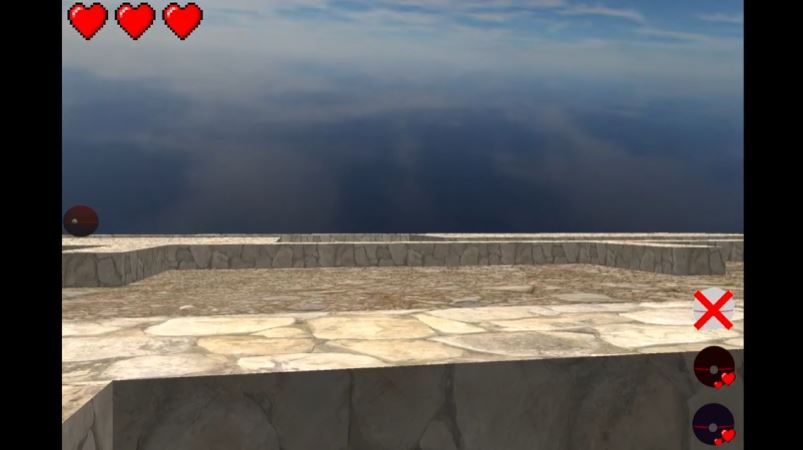

# ECS Custom Game Engine

An ECS (entity component system) game engine in the form of a DLL, written in C#.

An explanation of the design, including UML diagrams, can be found in the pdf [here.](https://github.com/henrypaul2001/ECSGameEngineDLL/blob/master/Games%20Architecture.pdf "ECS Engine Design")

A simple game was created to demonstrate the engine which can be downloaded in the [releases](https://github.com/henrypaul2001/ECSGameEngineDLL/releases "Releases") page.

It shows how the engine can be used, such as creating game specific collision managers, by inheriting from classes in the engine.

# Video

